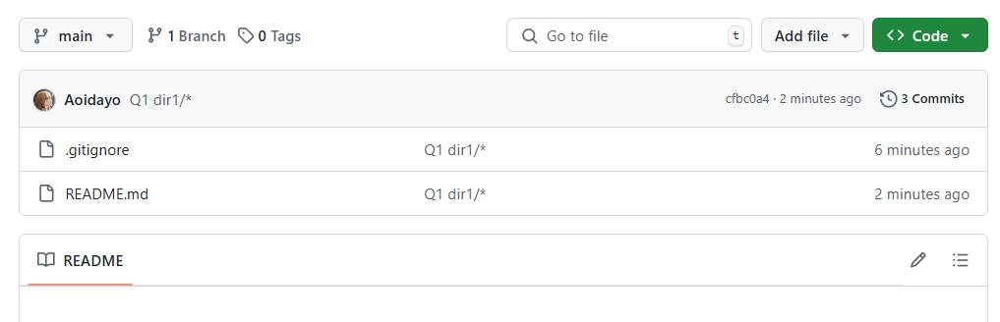

# text

测试git工具的功能


## 测试`.gitignore`

Q1: `dir/*`不忽略子文件夹中的文件，那么git上去的文件结构是什么样的？

A

目录结构

```
# dir : text
F:.
│  .gitignore
│  README.md
│
├─assets
└─dir1
    │  file1.txt
    │
    └─subdir1-1
        │  file1-1.txt
        │
        └─subdir1-1-1
                file1-1-1.txt
```

`.gitignore`

```
# Q1 dir1/*
dir1/*
```

结果：和理论不一样，实际上也忽略了一级子文件夹file1-1.txt ，与递归二级子文件夹`subdir1-1-1`里面的`file1-1-1.txt` 。



总结：

- 推荐使用`dir/**`或者`dir/`, 表意更清晰

